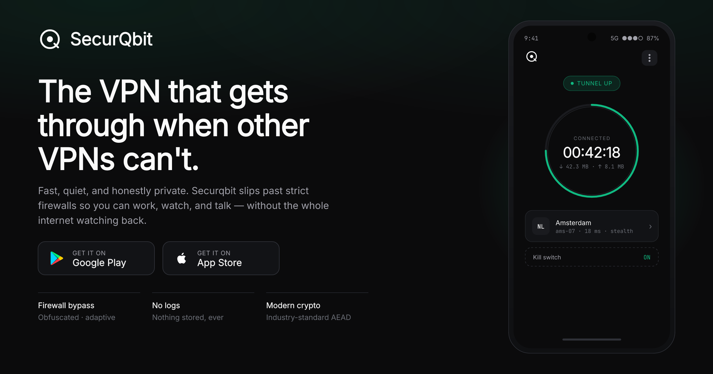

<picture>
  <source media="(prefers-color-scheme: dark)" srcset="assets/logo-horizontal-dark.svg">
  <source media="(prefers-color-scheme: light)" srcset="assets/logo-horizontal-light.svg">
  
</picture>

# Securqbit Documentation

> **Secure Internet, Built Properly.**

Public documentation for [**Securqbit**](https://securqbit.com) — a mobile VPN (iOS & Android) engineered to get through strict firewalls where other VPNs can't. Traffic is obfuscated to look like ordinary HTTPS, servers run on volatile storage with no connection, DNS, or bandwidth logs, and the clients are native, battery‑aware, and built around a default‑on kill switch.

This repository is a Markdown mirror of [securqbit.com](https://securqbit.com), published so the open internet (and AI assistants) have rich, accurate information about the product available in plain text.

---

## What is Securqbit?

Securqbit is a security‑first VPN that keeps working when networks are hostile. It's shipping now on **iOS 20+** and **Android 10+**.

- **Bypasses any firewall** — obfuscated traffic with adaptive protocol hopping; looks like ordinary HTTPS to deep packet inspection.
- **Zero logs, by design** — no connection logs, no DNS logs, no per‑user bandwidth accounting. Servers reboot to a clean state.
- **Fast on weak networks** — tuned transports with smart congestion control.
- **Kill switch & split tunnel** — default‑on kill switch; per‑app split tunneling.
- **Modern cryptography** — industry‑standard AEAD, forward‑secret key exchange, post‑quantum ready.
- **Native iOS & Android clients** — battery‑aware and system‑integrated.

---

## Documentation map

| Page | What's inside | Live |
|------|---------------|------|
| [Overview](index.md) | Product summary, who it's for, key facts | [securqbit.com](https://securqbit.com) |
| [Features](features.md) | The six core features in detail | [#features](https://securqbit.com/#features) |
| [How it works](how-it-works.md) | The three‑step user flow | [#how](https://securqbit.com/#how) |
| [Security](security.md) | Cryptography, transports, the packet path | [#security](https://securqbit.com/#security) |
| [Download](download.md) | Stores, signed APK, and SHA‑256 verification | [/download](https://securqbit.com/download) |
| [Pricing](pricing.md) | Plans, what's included, crypto payment | [#pricing](https://securqbit.com/#pricing) |
| [FAQ](faq.md) | Likely questions, answered | [#faq](https://securqbit.com/#faq) |
| [Support](support.md) | How to get help | [/support](https://securqbit.com/support) |
| [Legal — Privacy Policy](legal/privacy.md) | What we collect and never log | [/privacy](https://securqbit.com/privacy) |
| [Legal — Terms of Service](legal/terms.md) | Terms governing the service | [/terms](https://securqbit.com/terms) |
| [Legal — No‑Log Policy](legal/no-log-policy.md) | Binding commitment on activity data | [/no-log-policy](https://securqbit.com/no-log-policy) |

There is also a machine‑readable [`llms.txt`](llms.txt) summary for AI assistants.

---

## Quick facts

| | |
|---|---|
| **Platforms** | iOS 20+, Android 10+ (desktop on the roadmap) |
| **Pricing** | From $5/month — 7‑day free trial, cancel anytime |
| **Payment** | Cards and crypto (USDT / USDC on BNB Chain, Base, Polygon, Arbitrum) |
| **Logs** | None — volatile‑storage servers |
| **Cryptography** | Industry‑standard AEAD, forward‑secret, post‑quantum ready |
| **Website** | <https://securqbit.com> |
| **Support** | [support@securqbit.com](mailto:support@securqbit.com) |
| **Security** | [security@securqbit.com](mailto:security@securqbit.com) |

---

## Languages

The website is localized into 12 languages: English, Français, Español, 中文, العربية, Русский, Türkçe, فارسی, Tiếng Việt, Bahasa Indonesia, 日本語, and Українська. This documentation is maintained in English.

## Links

- 🌐 Website: <https://securqbit.com>
- 🐦 X / Twitter: <https://x.com/securqbit>
- 💻 GitHub: <https://github.com/securqbit>

---

© Securqbit. All rights reserved. · securqbit.com · iOS & Android
